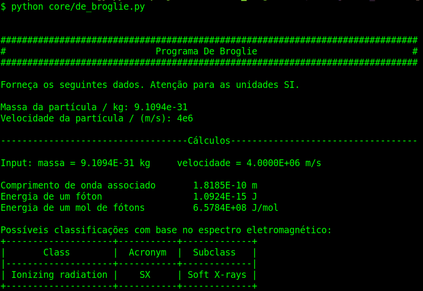

# Comprimento de onda - De Broglie

Programa simples para calcular o comprimento de onda associado à uma partícula
com massa e classificar esse comprimento de onda com base no espectro
eletromagnético. [Mais detalhes na Wikipedia](https://en.wikipedia.org/wiki/Matter_wave).

# Dependências

[SciPy](https://www.scipy.org/), [Pandas](https://pandas.pydata.org/),
[tabulate](https://github.com/astanin/python-tabulate).

# Uso

No momento, o programa pode ser acessado via terminal e os dados desejados
inseridos conforme as instruções. As duas imagens a seguir usam elétron como
exemplo, alterando a velocidade.

As funções isoladas podem ser acessadas
por importação em um terminal interativo ou em Jupyter Notebooks. (Tutorial a ser feito).

O programa se baseia na classificação das regiões espectrais dada pela
[ISO 21348](https://www.iso.org/standard/39911.html) para fornecer os nomes das
regiões associadas a um dado comprimento de onda. Mais de um nome pode ser
fornecido, já que diferentes áreas da ciência classificam de formas distintas
algumas regiões. O arquivo PDF da tabela dessa ISO e a tabela com os dados
que o programa usam se encontram na pasta core.

# Instalação

No momento, o repositório pode ser clonado. Ainda não há instalação via PyPI.

# Natureza do projeto

Esse é um projeto de ensino em fase inicial elaborado pelo professor Francisco
Bustamante e pelo aluno Fernando Fraga, ambos do IFRJ *campus* Rio de Janeiro.

# Citação

Caso tenha interesse em utilizar o projeto em publicações ou aulas, considere
citá-lo como

F. L. S. Bustamante & F. H. Fraga, *de Broglie*, 2020 - Disponível em:
https://github.com/fhfraga/de_broglie